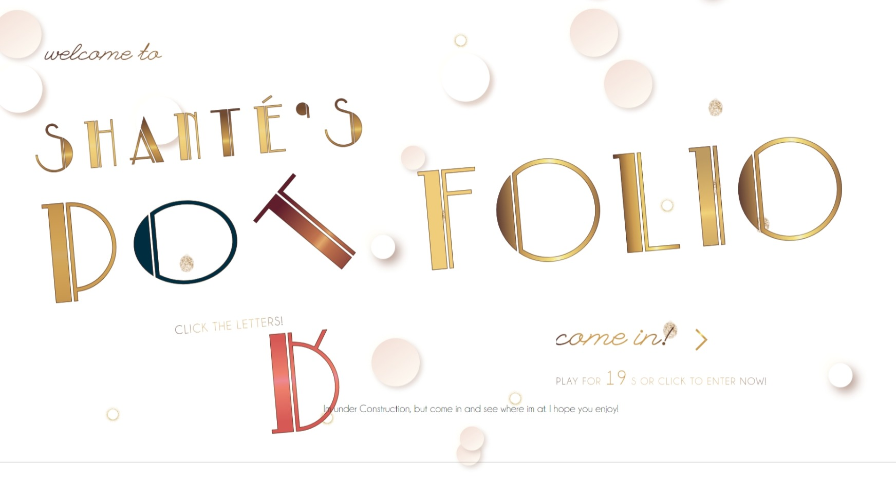
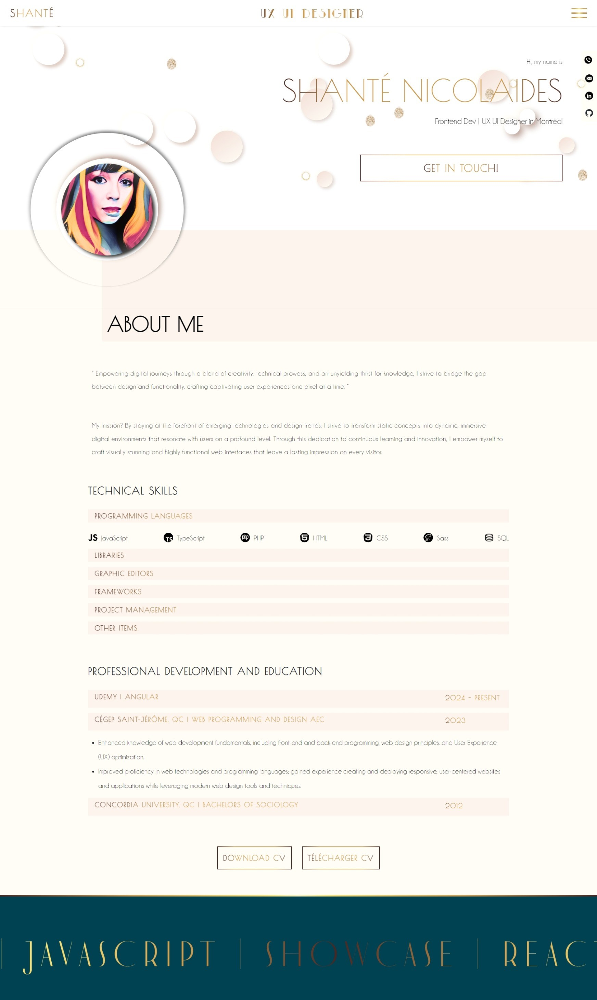
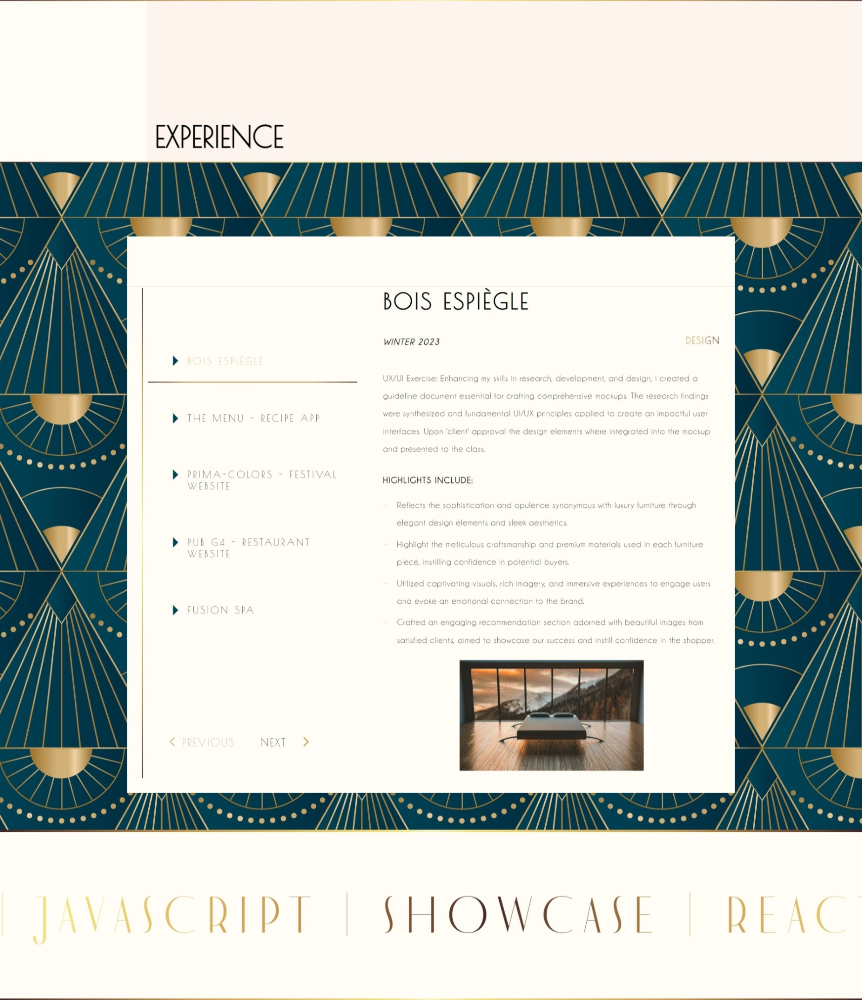
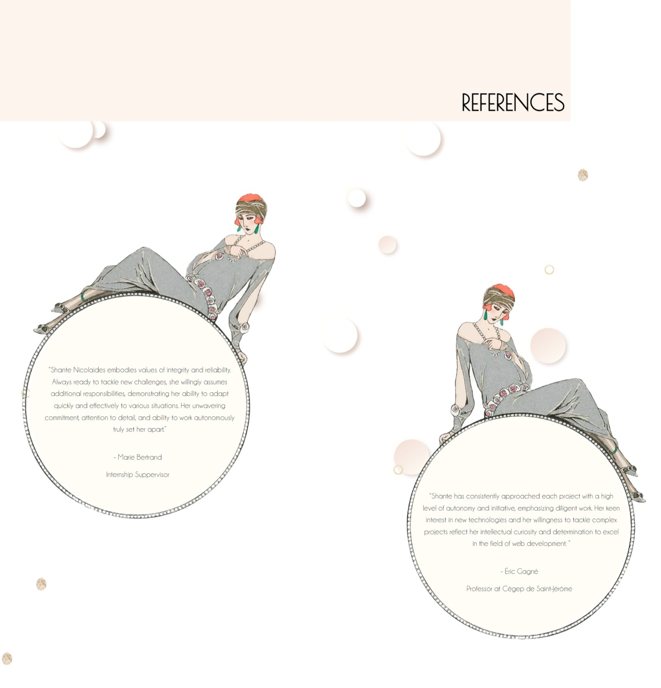
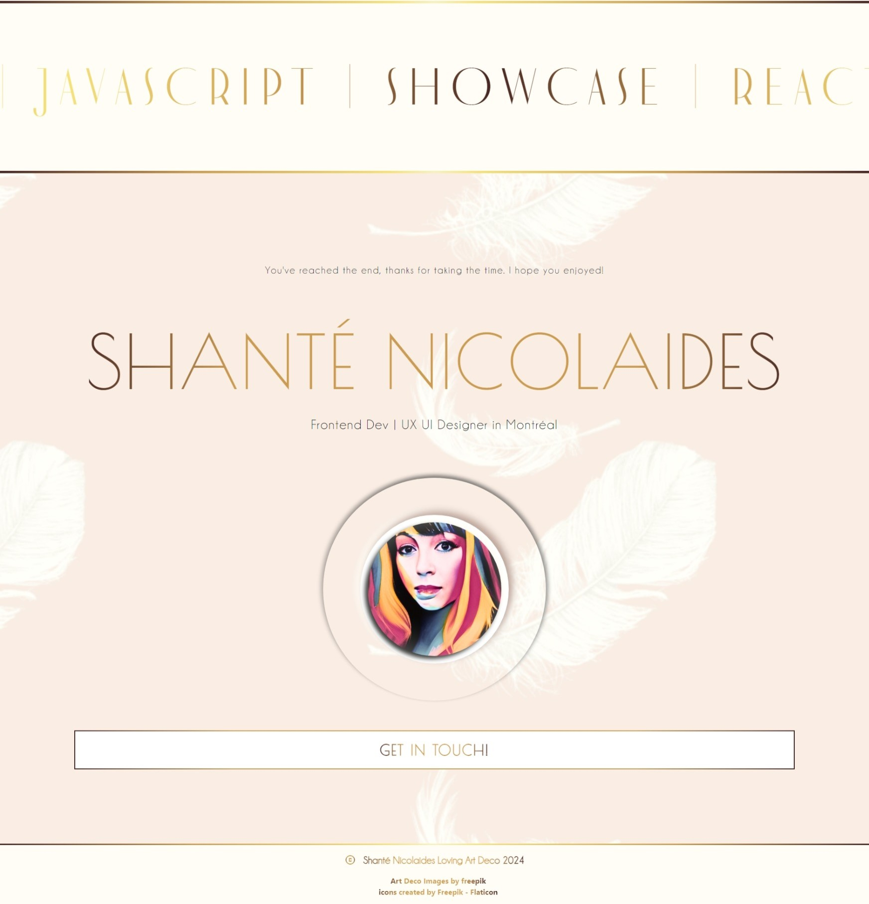
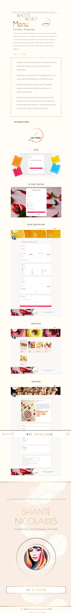
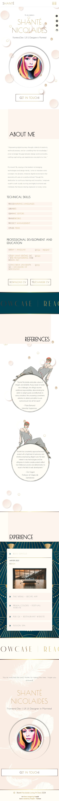

# Shanté's Portfolio: Where Functionality meets Artistry

Welcome to my portfolio, where creativity and functionality converge seamlessly. Here, I've embraced the opportunity to showcase my skills in a highly imaginative yet practical manner. Every aspect of this portfolio, from its captivating design to its flawless responsiveness on mobile, tablet, and desktop devices, reflects my dedication to both artistic expression and user experience.

## Design and Development Details

Crafted with Vue.js 3 and JavaScript, this portfolio is not just a showcase of my technical proficiency but also an exercise in pushing the boundaries of web design. I've leveraged CSS animations extensively, incorporating complex Art Deco-inspired elements to infuse each page with a touch of timeless elegance. Despite the challenges posed by executing such intricate designs in a web environment, I've strived to create an immersive experience that captivates visitors and leaves a lasting impression.

## Key Features:

- **Imaginative Design:** Embracing the spirit of Art Deco, I've woven intricate patterns and geometric motifs throughout the design, creating a visually stunning experience that sets this portfolio apart.
- **Responsive Across Devices:** Whether you're viewing on a smartphone, tablet, or desktop, rest assured that this portfolio adapts flawlessly to provide an optimal viewing experience on any screen size.
- **Vue.js 3 Powered:** Leveraging the power of Vue.js 3, I've built a dynamic and interactive interface that not only engages visitors but also ensures smooth navigation and functionality throughout.

## Experience the Magic

Explore each section of my portfolio to witness the harmony between creativity and functionality. From captivating animations to seamless user interactions, every detail has been meticulously crafted to showcase my skills and passion for web design.

## Get in Touch

I'm always eager to connect with fellow creatives and potential collaborators. Whether you have feedback, questions, or exciting project opportunities, feel free to reach out to me. Let's bring our visions to life together!

## Design

#### Animated Intro



#### About Me



#### Experience



#### References



#### Footer



#### Project Details



#### Mobile



## Project Setup

```sh
npm install
```

### Compile and Hot-Reload for Development

```sh
npm run dev
```

### Compile and Minify for Production

```sh
npm run build
```
